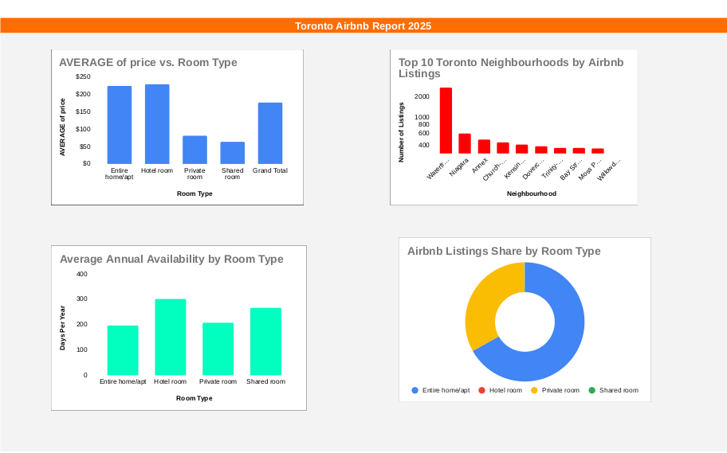
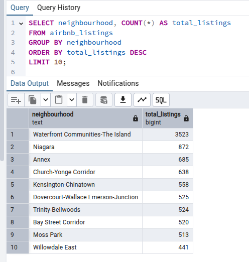
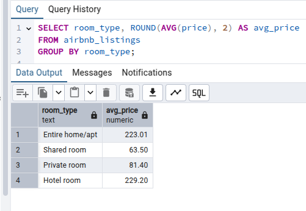
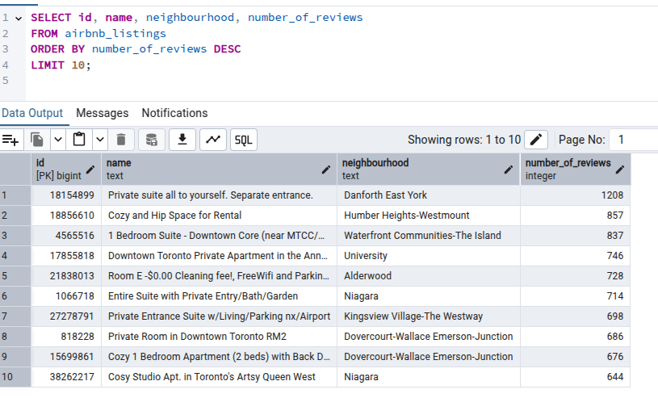

# 🏠 Airbnb Data Analysis – Excel Project

This project uses Microsoft Excel to explore and analyze Airbnb listings data. It focuses on uncovering insights about neighborhood activity, room types, and availability to better understand the short-term rental market.

## 📊 Key Insights

- 📍 Listings per Neighborhood – Which areas have the most listings?
- 🛏 Room Type Distribution – Which room types are most popular?
- 📅 Average Availability – How often are listings available in a year?

## 🛠 Tools Used

- Microsoft Excel
- Pivot Tables
- Bar & Pie Charts
- Data Cleaning (basic)

## Dashboard Preview

This is a snapshot of the Excel dashboard created using charts and pivot tables:

## 🧠 Key SQL Insights

### 1. Top 10 Neighbourhoods by Number of Listings

This query shows which neighbourhoods have the highest number of listings on Airbnb.

---

### 2. Average Price by Room Type

Shows how pricing varies between private rooms, shared rooms, and entire apartments.

---

### 3. Listings with the Most Reviews

Highlights the most popular listings based on review count.

---
> 💡 View all queries here → [airbnb_analysis_queries.sql](./sql/airbnb_analysis_queries.sql)

