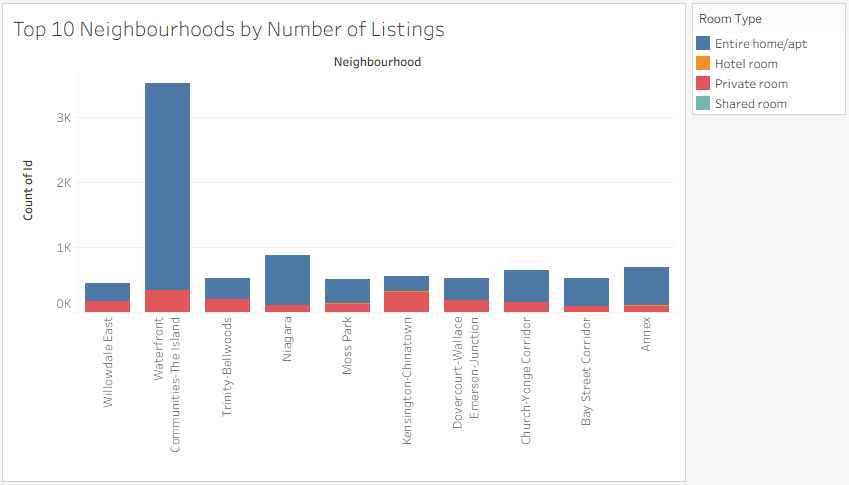
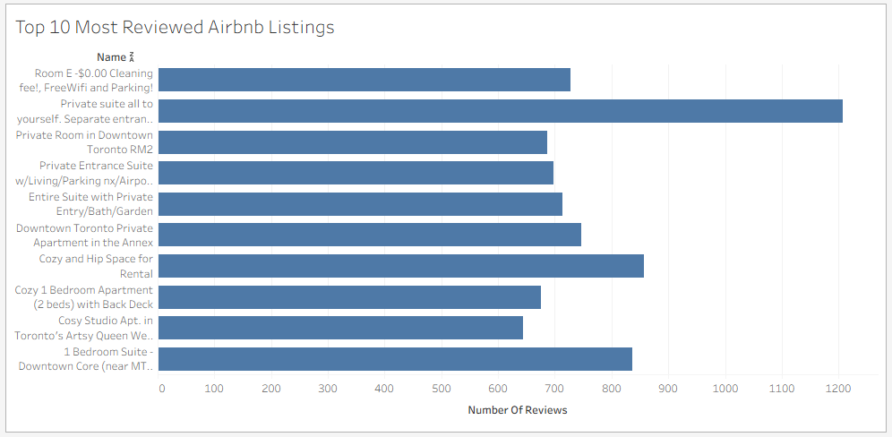
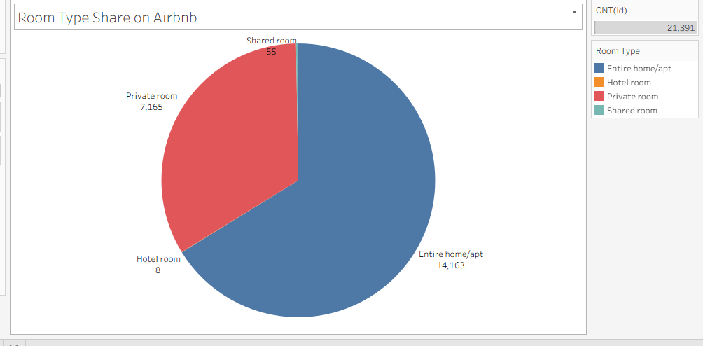

# 🏠 Airbnb Data Analysis – Excel Project

This project uses Microsoft Excel to explore and analyze Airbnb listings data. It focuses on uncovering insights about neighborhood activity, room types, and availability to better understand the short-term rental market.

## 📊 Key Insights

- 📍 Listings per Neighborhood – Which areas have the most listings?
- 🛏 Room Type Distribution – Which room types are most popular?
- 📅 Average Availability – How often are listings available in a year?

## 🛠 Tools Used

- Microsoft Excel
- Pivot Tables
- Bar & Pie Charts
- Data Cleaning (basic)

## Dashboard Preview

This is a snapshot of the Excel dashboard created using charts and pivot tables:

## 🧠 Key SQL Insights

### 1. Top 10 Neighbourhoods by Number of Listings

This query shows which neighbourhoods have the highest number of listings on Airbnb.

---

### 2. Average Price by Room Type

Shows how pricing varies between private rooms, shared rooms, and entire apartments.

---

### 3. Listings with the Most Reviews

Highlights the most popular listings based on review count.

---
> 💡 View all queries here → [airbnb_analysis_queries.sql](./sql/airbnb_analysis_queries.sql)

---
### 📊 Data Visualizations (Tableau)

The following charts were created using Tableau to provide deeper insights from the Airbnb listings dataset:

---

#### 1. Top 10 Neighbourhoods by Number of Listings

This stacked bar chart displays the 10 neighbourhoods in Toronto with the highest number of listings. Each bar is further divided by room type, showing how different types of accommodations (entire homes, private rooms, etc.) are distributed across locations.

---

#### 2. Top 10 Most Reviewed Airbnb Listings

This horizontal bar chart highlights the 10 listings with the highest number of reviews — a strong indicator of guest engagement and popularity on the platform.

---

#### 3. Room Type Share on Airbnb

This pie chart shows the share of different room types across all listings. Entire homes/apartments make up the majority, followed by private rooms, with hotel and shared rooms being much less common.

